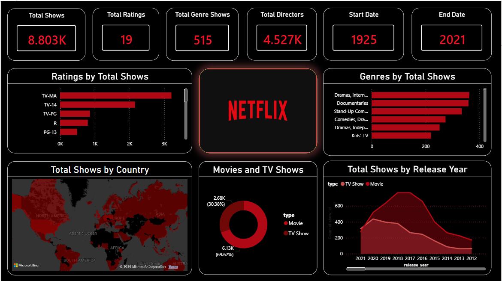

#  Netflix Data Analysis Dashboard

An interactive **Power BI** dashboard that analyzes Netflix's content library to uncover trends and insights about movies and TV shows available on the platform.

---

## 📊 Dashboard Preview

---

## 📌 Project Overview

This project explores Netflix's content dataset using **Power BI** to identify trends in content distribution, genres, ratings, release years, and countries. The dashboard provides interactive visualizations that enable users to explore the data and gain meaningful insights.

---

## 🎯 Objectives

- Analyze the distribution of Movies vs. TV Shows
- Explore content trends over the years
- Identify the most popular genres
- Examine content ratings
- Analyze country-wise content distribution
- Create an interactive dashboard for data exploration

---

## 🛠️ Tools Used

- Power BI
- DAX
- Microsoft Excel

---

## 📈 Key Insights

- Movies account for the majority of Netflix's content library.
- Drama and Comedy are among the most popular genres.
- Netflix experienced significant content growth after 2015.
- The United States and India contribute the highest number of titles.

---

## 📂 Repository Contents

| File | Description |
|------|-------------|
| `Netflix.pbix` | Power BI dashboard file |
| `netflix_titles.csv` | Dataset used for analysis |
| `dashboard.png` | Dashboard screenshot |
| `README.md` | Project documentation |

---

## 🚀 How to Use

1. Download the `.pbix` file.
2. Open it using **Power BI Desktop**.
3. Explore the interactive dashboard.
4. Use the provided dataset to recreate or modify the analysis.

---

## 📷 Dashboard Features

- KPI Cards
- Movies vs. TV Shows Analysis
- Genre Distribution
- Ratings Analysis
- Country-wise Content Analysis
- Content Release Trends
- Interactive Filters (Slicers)

---

## 👩‍💻 Author

**Hamna Fazil**

Aspiring Data Analyst | Business Intelligence Enthusiast

- LinkedIn: https://www.linkedin.com/in/hamna-fazil-b95279205/
- GitHub: https://github.com/HamnaFazil-DataAnalyst

---

⭐ If you found this project helpful, consider giving this repository a **Star**!
